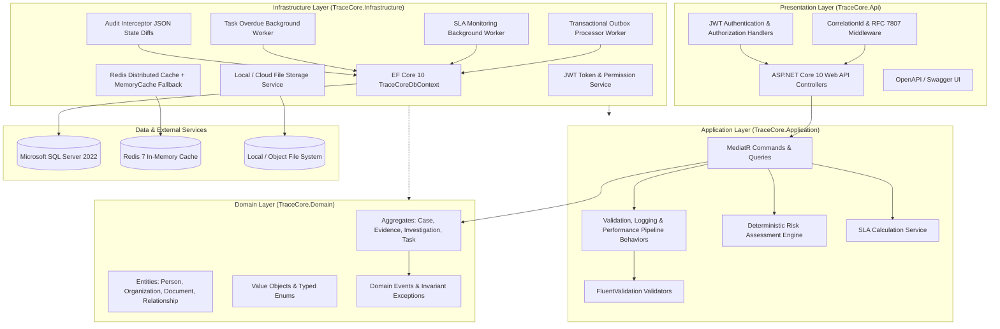
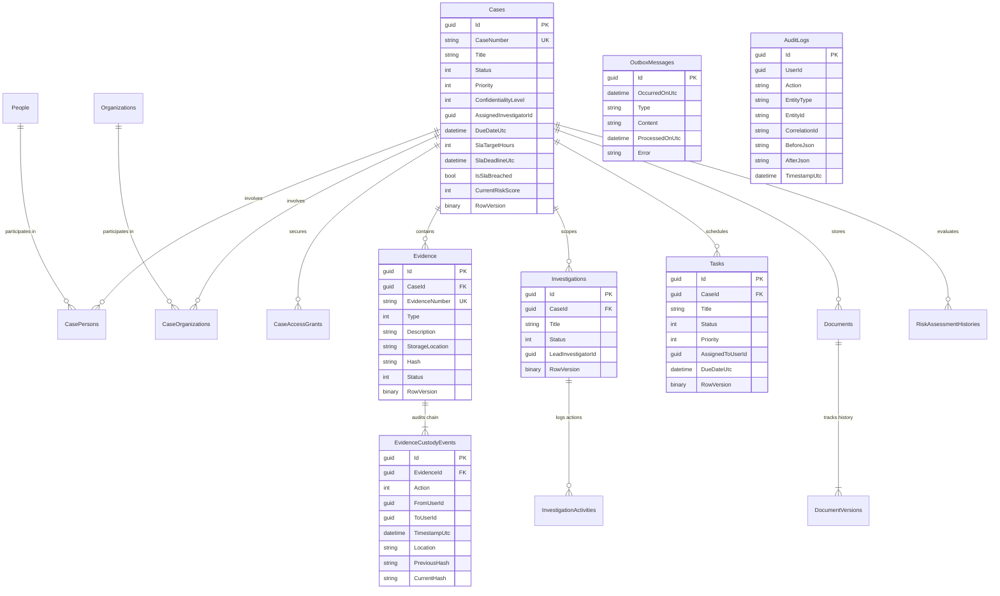
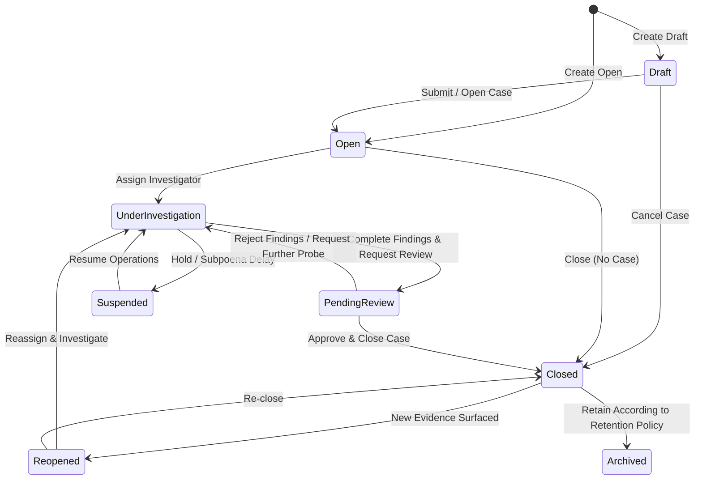
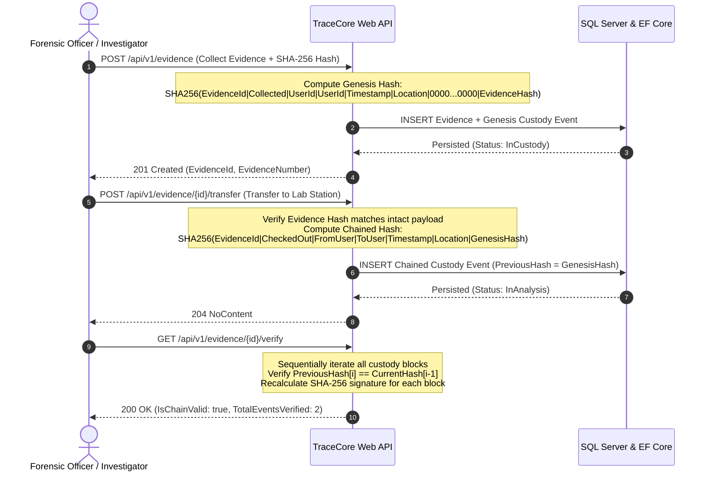
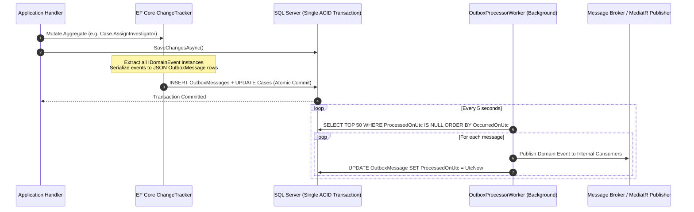

# TraceCore — Case, Investigation & Evidence Management Platform

[](https://dotnet.microsoft.com/)
[](https://learn.microsoft.com/en-us/dotnet/csharp/)
[](#system-architecture)
[](#cqrs--mediatr-pipeline)
[](https://learn.microsoft.com/en-us/ef/core/)
[](#docker-deployment)
[-brightgreen.svg)](#automated-testing)

**TraceCore** is an enterprise-grade backend platform engineered for intelligence units, legal authorities, compliance teams, and forensic investigators. It provides end-to-end lifecycle governance for complex investigations, participant tracking, relationship mapping, SLA deadline tracking, automated deterministic risk assessments, and a tamper-evident, cryptographically chained evidence custody ledger.

Built with **.NET 10**, **C# 13**, **ASP.NET Core Web API**, and **Entity Framework Core 10**, TraceCore strictly adheres to **Clean Architecture**, **Domain-Driven Design (DDD)**, and **CQRS (Command Query Responsibility Segregation)** principles.

---

## Table of Contents

- [Key Capabilities](#key-capabilities)
- [System Architecture](#system-architecture)
- [Database Schema & ERD](#database-schema--erd)
- [Case Lifecycle State Machine](#case-lifecycle-state-machine)
- [Evidence Chain of Custody (Cryptographic SHA-256 Chaining)](#evidence-chain-of-custody)
- [Transactional Outbox Pattern](#transactional-outbox-pattern)
- [Layered Security & Authorization](#layered-security--authorization)
- [Deterministic Risk Scoring Engine](#deterministic-risk-scoring-engine)
- [Technology Stack](#technology-stack)
- [Solution Structure](#solution-structure)
- [REST API Reference](#rest-api-reference)
- [Getting Started](#getting-started)
  - [Prerequisites](#prerequisites)
  - [Docker Compose Deployment (Recommended)](#docker-compose-deployment-recommended)
  - [Local Development Setup](#local-development-setup)
- [Seed Accounts & Role Credentials](#seed-accounts--role-credentials)
- [Automated Testing](#automated-testing)
- [License](#license)

---

## Key Capabilities

* **Case & Investigation Management**: Complete lifecycle workflows with strict state transitions (`Draft` → `Open` → `UnderInvestigation` → `PendingReview` → `Closed` / `Archived` / `Reopened`).
* **Cryptographic Evidence Chain of Custody**: Immutable SHA-256 hash chaining linking each transfer to the predecessor block (`PreviousHash` → `CurrentHash`), ensuring verifiable integrity from crime scene to courtroom.
* **Deterministic Risk Engine**: Mathematical risk scoring evaluating 6 distinct risk vectors with automated priority escalation triggers.
* **SLA & Deadline Monitoring**: Configurable target hours by priority/type with automated background workers flagging breaches and alerting supervisors.
* **Resource-Level Access Control**: Granular case security (`CaseAccessGrant`) supplementing role-based permissions (`Admin`, `ReadWrite`, `ReadOnly`).
* **Participant & Network Relationship Mapping**: Track people, organizations, and bidirectional typed relationships with confidence ratings and active timeframes.
* **Document Versioning & Storage**: Metadata-rich document repository with file streaming, SHA-256 payload integrity hashing, and version increments.
* **Transactional Outbox**: Guaranteed at-least-once asynchronous domain event delivery within the exact same database transaction.
* **Deep Audit Interceptor**: Automatic JSON before/after state diff recording on every entity modification with correlation ID tracking.
* **Distributed Caching**: Redis caching with automated local in-memory fallback for query optimization.

---

## System Architecture

TraceCore follows **Clean Architecture** and **Domain-Driven Design (DDD)** boundaries:



---

## Database Schema & ERD

The relational database architecture is designed with strict foreign key constraints, composite performance indexes, optimistic concurrency tokens (`RowVersion`), and normalized event stores:



---

## Case Lifecycle State Machine

TraceCore enforces strict state machine rules with domain-level validation protecting against invalid workflows:



---

## Evidence Chain of Custody

The chain of custody employs **cryptographic SHA-256 block-hashing** with millisecond-aligned UTC timestamps:



---

## Transactional Outbox Pattern

To prevent dual-write anomalies and guarantee reliable event delivery, domain events are serialized to an `OutboxMessages` table in the exact same database transaction as business entities:



---

## Layered Security & Authorization

TraceCore enforces security in depth across three distinct verification layers:

1. **Authentication**: Cryptographically signed **JWT Bearer** tokens with HMAC-SHA256, custom identity claims, and configurable expiration.
2. **Role-Based & Permission Authorization**: Dynamic authorization policies mapped to granular permissions (`cases.read`, `cases.write`, `evidence.transfer`, `reports.view`).
3. **Resource-Level Case Access Control**: The `ICaseAuthorizationService` evaluates explicit `CaseAccessGrant` records (`Admin`, `ReadWrite`, `ReadOnly`) before granting data mutation rights to non-administrator users.

```
Request ──> [JWT Authentication] ──> [Permission Requirement Policy] ──> [Case Resource Grant Verification] ──> Handler
```

### Pre-defined Roles & Permissions

| Role | Permissions |
|---|---|
| **Administrator** | Full access to all platform capabilities, cases, user access grants, and system audit logs. |
| **Supervisor** | Case management, investigator assignment, case status changes, review approvals, reports, risk assessments. |
| **Investigator** | Read/write assigned cases, evidence intake/transfer, document upload/versioning, activities, tasks. |
| **Analyst** | Read-only access to assigned cases, evidence verification, document reading, report generation. |
| **Auditor** | Read-only platform-wide audit log access, evidence chain verification, report generation. |

---

## Deterministic Risk Scoring Engine

TraceCore implements a deterministic, mathematical risk scoring engine evaluated across **6 distinct risk vectors**:

$$\text{Total Risk Score} = \min\left(100, \sum_{i=1}^{6} \text{Factor Score}_i \times \text{Weight}_i\right)$$

| Factor | Weight | Evaluation Criteria |
|---|---|---|
| **Case Priority** | 20% | Critical: 100, High: 75, Medium: 40, Low: 10 |
| **SLA Urgency** | 25% | Breached: 100, <24h remaining: 80, <72h remaining: 50 |
| **Critical Evidence** | 20% | Evaluates percentage of evidence marked as high-value / critical |
| **High-Risk Entities** | 15% | Flags entities with suspect or target classifications |
| **Task Overdue Burden** | 10% | Calculates ratio of overdue investigative tasks |
| **Confidentiality Scope** | 10% | TopSecret: 100, Confidential: 75, Restricted: 50, Internal: 25 |

### Automated Escalation Trigger
If the calculated risk score exceeds **80** (`Critical`), the engine automatically triggers a `CaseRiskLevelChangedDomainEvent` and escalates the case priority to **High** if it was previously lower.

---

## Technology Stack

* **Runtime & Language**: [.NET 10 (net10.0)](https://dotnet.microsoft.com/), [C# 13](https://learn.microsoft.com/en-us/dotnet/csharp/)
* **Web Framework**: ASP.NET Core Web API with Minimal Hosting & Controller architecture
* **Persistence & Database**: Entity Framework Core 10, SQL Server 2022
* **Mediator & CQRS**: [MediatR](https://github.com/jbogard/MediatR) (Pipeline Behaviors for Validation, Logging, Metrics)
* **Validation**: [FluentValidation](https://fluentvalidation.net/) with automatic pipeline interception
* **Distributed Caching**: [StackExchange.Redis](https://stackexchange.github.io/StackExchange.Redis/) with `IMemoryCache` fallback
* **Security & Auth**: `Microsoft.AspNetCore.Authentication.JwtBearer`, custom authorization policies
* **Logging & Observability**: [Serilog](https://serilog.net/) (Console & Rolling File Sinks), [OpenTelemetry](https://opentelemetry.io/) distributed tracing
* **API Documentation**: [Swagger / Swashbuckle](https://github.com/domaindrivendev/Swashbuckle.AspNetCore) (OpenAPI 3.0 with JWT Bearer schemes)
* **Testing**: [xUnit](https://xunit.net/), [FluentAssertions](https://fluentassertions.com/), `Microsoft.AspNetCore.Mvc.Testing`
* **Containerization**: Multi-stage [Dockerfile](Dockerfile), [Docker Compose](docker-compose.yml)

---

## Solution Structure

```
TraceCore/
├── src/
│   ├── TraceCore.Domain/             # Core business aggregates, entities, events, enums, exceptions
│   │   ├── Common/                   # BaseEntity, IAggregateRoot, IDomainEvent
│   │   ├── Entities/                 # Cases, Evidence, Investigations, Tasks, People, Documents, etc.
│   │   ├── Enums/                    # Typed domain enumerations (CaseStatus, CustodyAction, etc.)
│   │   └── Events/                   # Domain event definitions
│   │
│   ├── TraceCore.Application/        # Use cases, MediatR commands, queries, validators, DTOs, interfaces
│   │   ├── Common/                   # Pipeline behaviors, interfaces, exceptions
│   │   ├── Cases/                    # Case management CQRS handlers & DTOs
│   │   ├── Evidence/                 # Evidence & custody verification handlers
│   │   ├── Investigations/           # Investigation workflows & activity logging
│   │   ├── Tasks/                    # Task assignment & status transitions
│   │   ├── People/                   # Person directory & case associations
│   │   ├── Organizations/            # Organization directory & case associations
│   │   ├── Relationships/            # Entity-to-entity relationship graphing
│   │   ├── Documents/                # Document upload, versioning & retrieval
│   │   ├── Risk/                     # Risk assessment engine & queries
│   │   ├── Search/                   # Unified multi-entity search
│   │   ├── Notifications/            # User notification management
│   │   ├── Audit/                    # Audit log query handlers
│   │   ├── Reports/                  # Investigative summary report generation
│   │   └── Services/                 # RiskAssessmentService, SlaCalculationService
│   │
│   ├── TraceCore.Infrastructure/     # Persistence, external adapters, background workers, security
│   │   ├── Persistence/              # TraceCoreDbContext, EntityConfigurations, AuditInterceptor
│   │   ├── Security/                 # JwtTokenService, CaseAuthorizationService
│   │   ├── Caching/                  # RedisCacheService
│   │   ├── Storage/                  # LocalFileStorage
│   │   └── BackgroundWorkers/        # OutboxProcessor, SlaMonitoring, TaskOverdue
│   │
│   └── TraceCore.Api/                # REST Controllers, Middlewares, DI composition, OpenAPI, Seed Data
│       ├── Controllers/              # 14 REST API controllers
│       ├── Middlewares/              # CorrelationId, RFC 7807 ExceptionHandling
│       ├── Services/                 # CurrentUserService, PermissionAuthorizationHandler
│       ├── Data/                     # DataSeeder (admin, supervisor, investigator, analyst accounts)
│       └── Program.cs                # Web API composition root
│
├── tests/
│   ├── TraceCore.UnitTests/          # 24 Domain unit tests (invariants, state machine, SLA, hash chaining)
│   └── TraceCore.IntegrationTests/   # 4 End-to-end API integration tests (Full investigative workflow)
│
├── docs/                             # Architecture Decision Records, Database Schema, Security Specs
│   ├── ARCHITECTURE.md
│   ├── DATABASE-DESIGN.md
│   ├── SECURITY.md
│   └── API.md
│
├── Dockerfile                        # Multi-stage optimized production Docker image
├── docker-compose.yml                # API + SQL Server 2022 + Redis 7 setup
└── TraceCore.sln                     # Complete Visual Studio / dotnet solution
```

---

## REST API Reference

The API is fully documented via interactive **Swagger UI** available at `/swagger` when the application is running.

| HTTP Method | Route | Description | Required Permission |
|---|---|---|---|
| `POST` | `/api/v1/auth/login` | Authenticate user and obtain JWT Bearer token | Public |
| `GET` | `/api/v1/cases` | Search and filter cases with pagination | `cases.read` |
| `POST` | `/api/v1/cases` | Create a new case (Draft or Open) | `cases.write` |
| `GET` | `/api/v1/cases/{id}` | Retrieve comprehensive case details | `cases.read` |
| `PUT` | `/api/v1/cases/{id}` | Update case metadata | `cases.write` |
| `POST` | `/api/v1/cases/{id}/status` | Transition case lifecycle status | `cases.status` |
| `POST` | `/api/v1/cases/{id}/assign` | Assign investigator or team to case | `cases.assign` |
| `POST` | `/api/v1/cases/{id}/priority` | Update priority with justification | `cases.write` |
| `POST` | `/api/v1/cases/{id}/access` | Grant resource-level access to user | `cases.admin` |
| `DELETE` | `/api/v1/cases/{id}/access/{userId}` | Revoke user access to case | `cases.admin` |
| `POST` | `/api/v1/evidence` | Intake evidence with initial SHA-256 hash | `evidence.write` |
| `GET` | `/api/v1/evidence/{id}` | Get evidence details with custody history | `evidence.read` |
| `GET` | `/api/v1/evidence/case/{caseId}` | Get all evidence for a case | `evidence.read` |
| `POST` | `/api/v1/evidence/{id}/transfer` | Transfer custody with cryptographic hash chain | `evidence.transfer` |
| `GET` | `/api/v1/evidence/{id}/verify` | Verify cryptographic custody chain integrity | `evidence.read` |
| `POST` | `/api/v1/investigations` | Open new investigation under a case | `investigations.write` |
| `POST` | `/api/v1/investigations/{id}/activities` | Record investigative action or interview log | `investigations.write` |
| `POST` | `/api/v1/tasks` | Create investigative task with deadline | `tasks.write` |
| `POST` | `/api/v1/tasks/{id}/status` | Update task status (`InProgress`, `Completed`) | `tasks.write` |
| `POST` | `/api/v1/documents/upload` | Upload document file with metadata & SHA-256 | `documents.write` |
| `GET` | `/api/v1/documents/{id}/download` | Stream document payload with integrity verification | `documents.read` |
| `POST` | `/api/v1/people` | Register person in directory | `people.write` |
| `POST` | `/api/v1/people/case` | Link person to case with participant role | `people.write` |
| `POST` | `/api/v1/organizations` | Register organization in directory | `organizations.write` |
| `POST` | `/api/v1/organizations/case` | Link organization to case with role | `organizations.write` |
| `POST` | `/api/v1/relationships` | Graph relationship between two entities | `cases.write` |
| `POST` | `/api/v1/risk/cases/{id}/assess` | Trigger deterministic risk assessment | `cases.write` |
| `GET` | `/api/v1/risk/cases/{id}/history` | Get historical risk assessment snapshots | `cases.read` |
| `GET` | `/api/v1/search` | Multi-entity cross-system full-text search | `cases.read` |
| `GET` | `/api/v1/reports/cases/{id}/summary` | Generate executive case report summary | `reports.view` |
| `GET` | `/api/v1/audit/entity/{type}/{id}` | Retrieve immutable audit timeline with state diffs | `audit.read` |
| `GET` | `/health` | System health check (database connectivity) | Public |

---

## Getting Started

### Prerequisites

* [.NET 10 SDK](https://dotnet.microsoft.com/download/dotnet/10.0)
* [Docker Desktop](https://www.docker.com/products/docker-desktop/) (with Docker Compose v2)
* Optional: [SQL Server Management Studio (SSMS)](https://learn.microsoft.com/en-us/sql/ssms/download-sql-server-management-studio-ssms) or Azure Data Studio

---

### Docker Compose Deployment (Recommended)

Launch the entire stack (TraceCore Web API, Microsoft SQL Server 2022, and Redis 7) with a single command:

```bash
docker compose up -d --build
```

Once running:
* **Swagger API Documentation**: [http://localhost:5000/swagger](http://localhost:5000/swagger)
* **Health Check**: [http://localhost:5000/health](http://localhost:5000/health)
* **SQL Server**: `localhost:1433` (User: `sa`, Password: `TraceCoreSecureP@ssw0rd!2026`)
* **Redis**: `localhost:6379`

To shut down and remove volumes:
```bash
docker compose down -v
```

---

### Local Development Setup

1. **Clone the repository**:
   ```bash
   git clone https://github.com/your-org/TraceCore.git
   cd TraceCore
   ```

2. **Configure Environment Variables**:
   Copy `.env.example` to `.env` or verify connection strings in `src/TraceCore.Api/appsettings.Development.json`. By default, LocalDB is configured:
   ```json
   "ConnectionStrings": {
     "DefaultConnection": "Server=(localdb)\\mssqllocaldb;Database=TraceCoreDb;Trusted_Connection=True;MultipleActiveResultSets=true",
     "Redis": ""
   }
   ```

3. **Restore & Build**:
   ```bash
   dotnet restore
   dotnet build -c Release
   ```

4. **Run the API**:
   ```bash
   dotnet run --project src/TraceCore.Api/TraceCore.Api.csproj
   ```
   Navigate to `https://localhost:5001/swagger` or `http://localhost:5000/swagger`.

---

## Seed Accounts & Role Credentials

When launched in `Development` mode, TraceCore automatically seeds test accounts:

| Role | Email | Password | Pre-seeded Permissions |
|---|---|---|---|
| **Administrator** | `admin@tracecore.gov` | `Admin@TraceCore2026!` | All platform permissions (`*`) |
| **Supervisor** | `supervisor@tracecore.gov` | `Supervisor@TraceCore2026!` | Case status, assignment, approvals, reports |
| **Investigator** | `investigator@tracecore.gov` | `Investigator@TraceCore2026!` | Evidence, documents, activities, tasks |
| **Analyst** | `analyst@tracecore.gov` | `Analyst@TraceCore2026!` | Read-only cases, evidence verification |

To acquire a token via `curl`:
```bash
curl -X POST "http://localhost:5000/api/v1/auth/login" \
     -H "Content-Type: application/json" \
     -d '{"email":"admin@tracecore.gov","password":"Admin@TraceCore2026!"}'
```

---

## Automated Testing

TraceCore includes a comprehensive automated test suite spanning domain unit tests and end-to-end API integration tests:

```bash
# Execute entire test suite
dotnet test

# Execute Unit Tests only (Domain invariants, SLA engine, Hash chaining)
dotnet test tests/TraceCore.UnitTests/TraceCore.UnitTests.csproj

# Execute End-to-End API Integration Tests
dotnet test tests/TraceCore.IntegrationTests/TraceCore.IntegrationTests.csproj
```

### Test Coverage Summary

```
Total Test Projects: 2
- TraceCore.UnitTests:        24 Passed, 0 Failed (100% Success)
- TraceCore.IntegrationTests:  4 Passed, 0 Failed (100% Success)
Total Tests:                  28 Passed, 0 Failed (100% Success)
```

**Key Scenarios Validated**:
- Complete investigative lifecycle from Case draft creation to supervisor assignment.
- Evidence registration with SHA-256 intake checksum.
- Multi-step evidence custody transfer with hash chain verification.
- Automatic cryptographic tamper detection upon chain hash modification.
- Deterministic risk assessment engine calculation and auto-escalation rules.
- SLA target hours calculation and deadline breach detection.
- Case task state transitions (`InProgress` → `Completed` / `Cancelled`).
- Optimistic concurrency control (`RowVersion`) conflict detection.
- Role-based and permission-based endpoint authorization enforcement.

---

## License

This project is licensed under the MIT License — see the [LICENSE](LICENSE) file for details.
