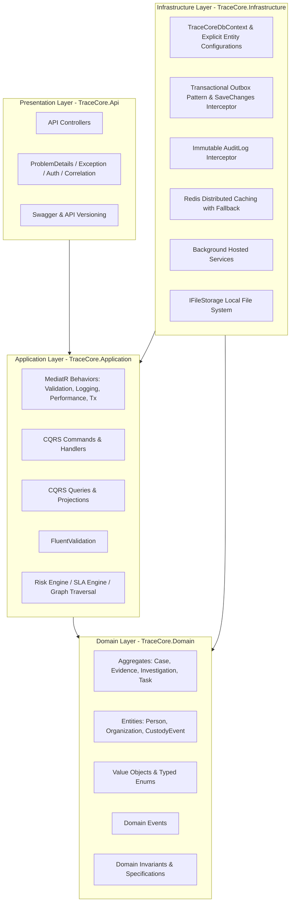
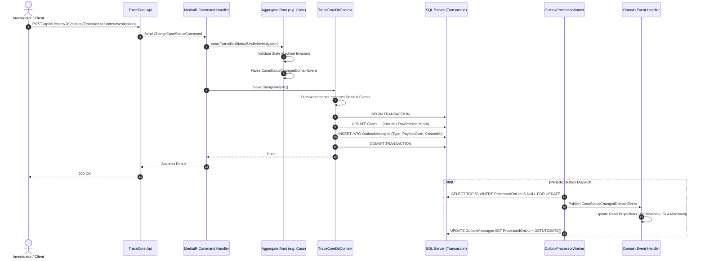

# TraceCore Architecture

TraceCore is a modular monolithic backend platform for Case, Investigation, and Evidence Management built on **.NET 10**, **C#**, **ASP.NET Core**, **Microsoft SQL Server**, and **Entity Framework Core**.

---

## 1. Architectural Style & Principles

TraceCore adopts **Clean Architecture** combined with **Domain-Driven Design (DDD)** and **Command Query Responsibility Segregation (CQRS)** via MediatR.

### Key Architectural Decisions (ADRs)

1. **Modular Monolith over Microservices**: TraceCore manages highly interconnected entities (Cases, Evidence, Custody, Investigations, Tasks, People, Organizations, Relationships). A modular monolith avoids premature distributed complexity, network latency, distributed transactions (2PC/Saga), and deployment overhead while maintaining strict module boundaries.
2. **Rich Domain Model vs. Anemic CRUD**: Business rules (e.g., status transitions, priority auto-escalation, tamper-evident hash chaining for evidence custody, risk factor scoring) are encapsulated in Domain Aggregates and Domain Services, never leaked into controllers or database triggers.
3. **CQRS with MediatR**: Write operations are structured as explicit Commands handled with validation, domain execution, and transactional outbox persistence. Read operations are structured as Queries utilizing EF Core `AsNoTracking()` projections directly to DTOs for maximum query performance.
4. **Transactional Outbox Pattern**: Entity changes and domain event outbox messages are committed in the same atomic database transaction. An asynchronous background processor dispatches domain events to handlers, guaranteeing at-least-once delivery without distributed two-phase commits.
5. **Optimistic Concurrency**: Aggregates with concurrent write scenarios (`Case`, `Evidence`, `Investigation`, `CaseTask`) use SQL Server `rowversion` concurrency tokens (`byte[] RowVersion`). Concurrent conflicting updates fail with `DbUpdateConcurrencyException`, translated cleanly into RFC 7807 `ProblemDetails` (HTTP 409 Conflict).

---

## 2. Layer Responsibilities & Dependencies

### Domain Layer (`TraceCore.Domain`)
- **No external dependencies** (pure C# standard library).
- Contains Aggregate Roots (`Case`, `Evidence`, `Investigation`), Entities (`Person`, `Organization`, `EntityRelationship`, `CaseTask`, `EvidenceCustodyEvent`, `Document`, `DocumentVersion`), Enums, Domain Events, and Custom Domain Exceptions.
- Enforces state transition matrices (e.g., `Draft -> Open -> UnderInvestigation -> PendingReview -> Resolved -> Closed`).
- Guarantees data integrity invariants.

### Application Layer (`TraceCore.Application`)
- Depends only on `TraceCore.Domain`.
- Contains CQRS Commands, Queries, Handlers, FluentValidation rules, Mapster configuration, Pipeline Behaviors, and service abstractions (`IApplicationDbContext`, `ICacheService`, `IFileStorage`, `INotificationService`, `IRiskAssessmentService`, `ISlaCalculationService`).
- MediatR Pipeline Behaviors:
  - `LoggingBehavior`: Structured logging with request payload and correlation ID.
  - `ValidationBehavior`: Automatic validation of incoming commands/queries before handler execution.
  - `PerformanceBehavior`: Latency tracking and alerting on queries/commands exceeding thresholds (500ms).
  - `TransactionBehavior`: Atomic database transaction management for write commands.

### Infrastructure Layer (`TraceCore.Infrastructure`)
- Implements application interfaces.
- Depends on `TraceCore.Application` and `TraceCore.Domain`.
- EF Core 10 DbContext with dedicated `IEntityTypeConfiguration<T>` for each entity.
- EF Core Interceptors:
  - `AuditInterceptor`: Captures entity changes and generates immutable `AuditLog` records with Before/After JSON diffs.
  - `OutboxInterceptor`: Automatically serializes domain events raised by aggregates into `OutboxMessage` records within the active transaction.
- Background Workers (`BackgroundService`):
  - `OutboxProcessorWorker`: Polls unhandled outbox records and publishes domain events via MediatR with exponential backoff retries.
  - `SlaMonitoringWorker`: Identifies upcoming and breached SLAs, triggering escalation and domain events.
  - `TaskOverdueWorker`: Identifies overdue tasks and notifies assigned investigators.
  - `RiskRecalculationWorker`: Periodically refreshes risk scores for open cases.
- Redis Caching Service: Resilient distributed caching with automatic fallback to memory cache if Redis is unavailable.
- File Storage: `LocalFileStorage` implementation with path traversal protections and SHA-256 stream hashing.

### Presentation Layer (`TraceCore.Api`)
- ASP.NET Core Web API with versioned controllers (`/api/v1/...`).
- Global exception handling middleware returning RFC 7807 ProblemDetails.
- JWT Bearer authentication and layered authorization (RBAC + Permission-based + Resource-level access).
- Serilog request logging with correlation ID propagation.
- Health checks for SQL Server and Redis (`/health`, `/health/ready`, `/health/live`).
- Swagger / OpenAPI documentation with JWT Bearer scheme.

---

## 3. Event & Outbox Flow

---

## 4. Layered Security Architecture

TraceCore employs a 3-tier security model:

1. **Authentication**: JWT Bearer tokens containing user ID, email, roles, and permission claims.
2. **Permission-Based Authorization (RBAC + Permissions)**:
   - Granular permissions (e.g., `Case.Read`, `Case.Create`, `Case.Close`, `Evidence.Transfer`).
   - Declarative policies (`[HasPermission(Permissions.Case.Close)]`).
3. **Resource / Case-Level Authorization**:
   - Explicit `CaseAccessGrant` records allowing specific users or teams to access cases with `Read`, `ReadWrite`, or `Admin` privileges.
   - Restricts access to `Confidential` or `Restricted` cases even if the user possesses general `Case.Read` permissions.

---

## 5. Performance & Caching Strategy

- **Queries**: Read queries bypass change tracking with `AsNoTracking()` and use direct projections to DTOs.
- **Indexes**: Composite, unique, and filtered indexes on high-frequency query columns (`CaseNumber`, `(Status, Priority)`, `AssignedInvestigatorId`, `SlaDeadlineUtc`, `RowVersion`).
- **Redis Caching**:
  - Key prefixes: `cases:summary:{id}`, `lookups:sla-policies`, `dashboards:metrics`.
  - Configurable TTLs (5 - 60 minutes).
  - Explicit cache eviction on command execution (write-through / invalidate).
  - Resilient in-memory fallback prevents application failure during Redis maintenance.
