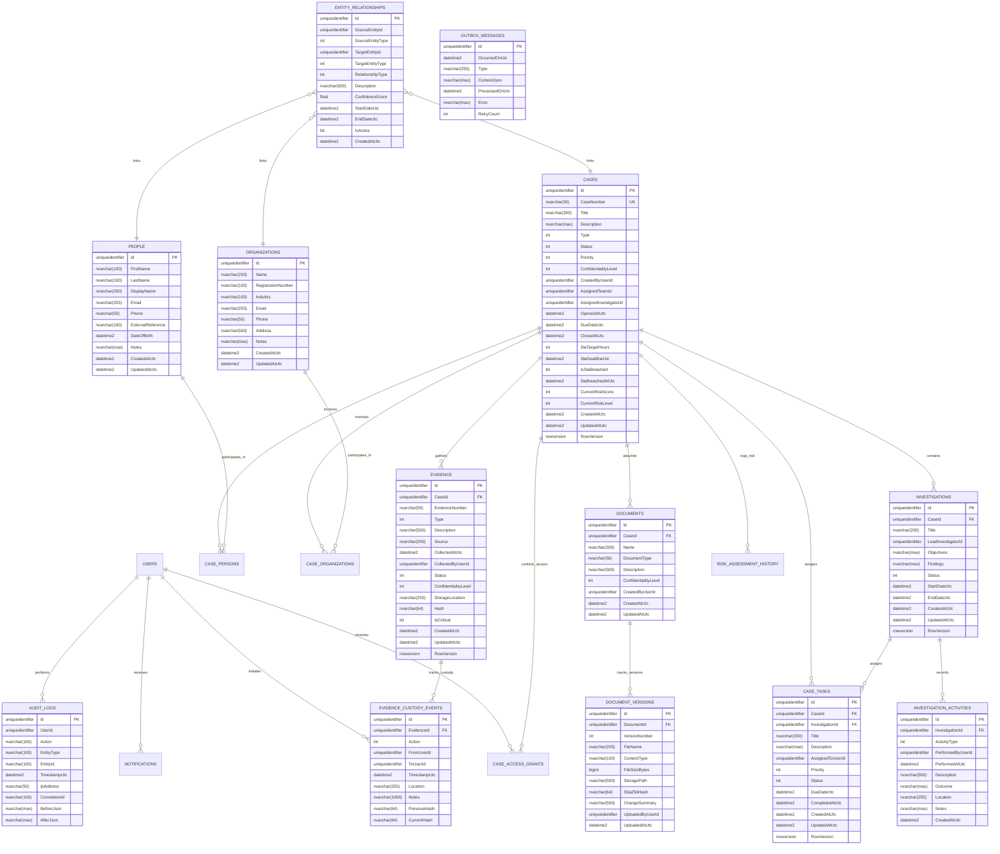

# TraceCore Database Design & Schema

TraceCore utilizes **Microsoft SQL Server** as its primary relational datastore with **Entity Framework Core 10**. This document details the database schema, entity relationships, indexes, constraints, concurrency controls, and design patterns.

---

## 1. Entity Relationship Diagram (ERD)



---

## 2. Table Specifications & Integrity Constraints

### `Cases`
- **Primary Key**: `Id` (`uniqueidentifier`, non-clustered or clustered GUID).
- **Unique Key**: `CaseNumber` (Formatted identifier, e.g., `CAS-2026-0001`).
- **Concurrency Token**: `RowVersion` (`rowversion / timestamp`).
- **Indexes**:
  - `IX_Cases_CaseNumber` (Unique)
  - `IX_Cases_Status_Priority` (Composite: facilitates dashboard and worklist filtering)
  - `IX_Cases_AssignedInvestigatorId` (Facilitates investigator dashboard lookup)
  - `IX_Cases_SlaDeadlineUtc_IsSlaBreached` (Filtered index for SLA background monitoring: `WHERE IsSlaBreached = 0 AND Status NOT IN (4, 5)`)
  - `IX_Cases_CreatedAtUtc` (Sorting and date-range queries)

### `Evidence` & `EvidenceCustodyEvents`
- **Tamper-Evident Chain of Custody**:
  - Each `EvidenceCustodyEvent` contains `PreviousHash` and `CurrentHash`.
  - `PreviousHash` strictly matches the preceding event's `CurrentHash`.
  - Cryptographic verification algorithm recalculates SHA-256 over:
    `SHA256(EvidenceId + Action + FromUserId + ToUserId + TimestampUtc + PreviousHash + Location)`
  - Append-only guarantee: `EvidenceCustodyEvents` records are immutable; modifications or deletions trigger application exceptions.
- **Indexes**:
  - `IX_Evidence_CaseId_EvidenceNumber` (Unique per case)
  - `IX_Evidence_Hash` (Quick deduplication and integrity audits)
  - `IX_EvidenceCustodyEvents_EvidenceId_TimestampUtc` (Clustered/ordered timeline retrieval)

### `EntityRelationships` (Universal Graph Schema)
- Connects any system entity (`Person`, `Organization`, `Case`, `Evidence`, `Document`) to any other entity.
- **Indexes**:
  - `IX_EntityRelationships_Source` (`SourceEntityType`, `SourceEntityId`)
  - `IX_EntityRelationships_Target` (`TargetEntityType`, `TargetEntityId`)
  - `IX_EntityRelationships_Type` (`RelationshipType`)
- Graph queries utilize recursive Common Table Expressions (CTEs) in SQL Server to find paths, cycles, and multi-hop ego graphs efficiently up to configurable depth without requiring an external graph database.

### `AuditLogs`
- Implements immutable system change tracking.
- Captured automatically via EF Core `SaveChangesInterceptor`.
- Serializes full entity state `BeforeJson` and `AfterJson` on state modifications.
- **Indexes**:
  - `IX_AuditLogs_EntityType_EntityId` (Entity history drill-down)
  - `IX_AuditLogs_TimestampUtc` (Time-series audit search)
  - `IX_AuditLogs_UserId` (User activity tracking)
  - `IX_AuditLogs_CorrelationId` (End-to-end request tracing)

### `OutboxMessages`
- Implements the Transactional Outbox pattern.
- Domain events are written to `OutboxMessages` within the same database transaction as business entities.
- **Indexes**:
  - `IX_OutboxMessages_ProcessedOnUtc_OccurredOnUtc` (Filtered index: `WHERE ProcessedOnUtc IS NULL`) for ultra-fast polling by background workers.

---

## 3. Concurrency Strategy
TraceCore uses optimistic concurrency control for all mutating aggregates:
- `Case`, `Evidence`, `Investigation`, and `CaseTask` declare a `byte[] RowVersion` column.
- In EF Core, this is configured via:
  ```csharp
  builder.Property(e => e.RowVersion).IsRowVersion();
  ```
- When a client issues an update, the request includes the `RowVersion`. If another transaction updated the row concurrently, EF Core raises `DbUpdateConcurrencyException`.
- The API's global exception handling middleware maps this to an RFC 7807 `ProblemDetails` response with HTTP Status `409 Conflict`.
