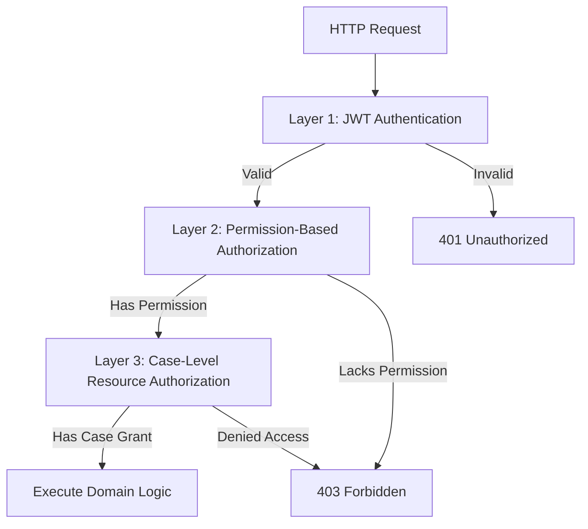

# TraceCore Security Architecture & Guidelines

TraceCore is designed for sensitive law enforcement, internal affairs, compliance, and investigative environments. This document outlines the security controls, authentication/authorization architecture, data protection mechanisms, and defense-in-depth strategies.

---

## 1. Authentication & JWT

TraceCore uses **JWT (JSON Web Tokens)** for stateless, cryptographically signed user authentication:
- Algorithm: HMAC-SHA256 (`HS256`) or asymmetric `RS256`.
- Token claims include:
  - `sub` (User ID / GUID)
  - `email` (User email address)
  - `name` (Display name)
  - `role` (Assigned system roles: `Administrator`, `CaseManager`, `Investigator`, `Reviewer`, `Auditor`, `Viewer`)
  - `permission` (Granular permission claims)
- Token expiration: Configurable short-lived access tokens (default 60 minutes) paired with secure refresh tokens.
- Validation: Validates Issuer, Audience, Lifetime, and Signing Key on every authenticated request.

---

## 2. Multi-Layered Authorization Model

TraceCore implements a three-tier defense-in-depth authorization model:



### Layer 1: Authentication
Ensures the client presents a valid, unexpired JWT signed by the trusted authority.

### Layer 2: Permission-Based Authorization
Permissions represent specific business capabilities:
- **Case**: `Case.Read`, `Case.Create`, `Case.Update`, `Case.Close`, `Case.Reopen`
- **Evidence**: `Evidence.Read`, `Evidence.Create`, `Evidence.Transfer`, `Evidence.Archive`
- **Investigation**: `Investigation.Read`, `Investigation.Create`, `Investigation.Assign`, `Investigation.Review`
- **Audit**: `Audit.Read`
- **Reports**: `Reports.Read`
- **Administration**: `Administration.Manage`

Controllers and endpoints declare requirements via:
```csharp
[HasPermission(Permissions.Case.Close)]
```

### Layer 3: Resource / Case-Level Authorization
Certain cases possess heightened confidentiality (`Confidential`, `Restricted`, `TopSecret`).
- Even if a user possesses `Case.Read` permission, they cannot view a restricted case unless an explicit `CaseAccessGrant` exists for their `UserId` or `TeamId`.
- Access levels:
  - `Read`: Allows viewing case details, evidence, and investigation activities.
  - `ReadWrite`: Allows adding evidence, tasks, and investigation notes.
  - `Admin`: Allows assigning investigators, changing confidentiality, and closing/reopening the case.

---

## 3. Evidence Integrity & Cryptographic Chain of Custody

Evidence tampering is prevented through cryptographic hash verification:
1. **Initial Acquisition**: When evidence is logged, a cryptographic SHA-256 hash of the artifact or physical identifier is calculated and stored.
2. **Immutable Custody Events**: Every change in possession, inspection, or transfer generates an `EvidenceCustodyEvent`.
3. **Hash Chaining**:
   $$\text{CurrentHash} = \text{SHA256}(\text{EvidenceId} + \text{Action} + \text{FromUserId} + \text{ToUserId} + \text{TimestampUtc} + \text{PreviousHash} + \text{Location})$$
4. **Append-Only Enforcement**: EF Core interceptors and database rules disallow `UPDATE` or `DELETE` on `EvidenceCustodyEvents`.
5. **Integrity Auditing**: An audit endpoint (`GET /api/v1/evidence/{id}/verify`) walks the hash chain from genesis to the latest custody event, flagging any recalculation mismatch.

---

## 4. Audit Trail Immutability

- Every mutating action (Insert, Update, Delete) is captured in `AuditLogs`.
- Captures: `UserId`, `Action`, `EntityType`, `EntityId`, `TimestampUtc`, `IpAddress`, `CorrelationId`, and full before/after JSON diffs.
- `AuditLogs` records are write-only. No application role (including `Administrator`) can modify or delete audit records via API endpoints.

---

## 5. Defense Against Common Vulnerabilities

| Threat | TraceCore Mitigation |
|---|---|
| **SQL Injection** | Parametrized queries via Entity Framework Core LINQ. Raw SQL is avoided or strictly parametrized. |
| **Broken Object Level Auth (BOLA/IDOR)** | Layer 3 Resource Authorization enforces case ownership/grant validation on every entity query by ID. |
| **Mass Assignment** | Strict separation of API Request DTOs from Domain Entities; payloads are mapped explicitly via Mapster/constructors. |
| **Path Traversal** | File storage validates file extensions against an allowlist, strips invalid characters, and stores files with random GUIDs rather than original user-supplied filenames. |
| **Sensitive Data Exposure** | Password hashes use BCrypt with high work factor; ProblemDetails middleware strips stack traces and internal exceptions in production. |
| **Concurrency Race Conditions** | Optimistic concurrency via SQL Server `rowversion` prevents dirty writes and lost updates. |
